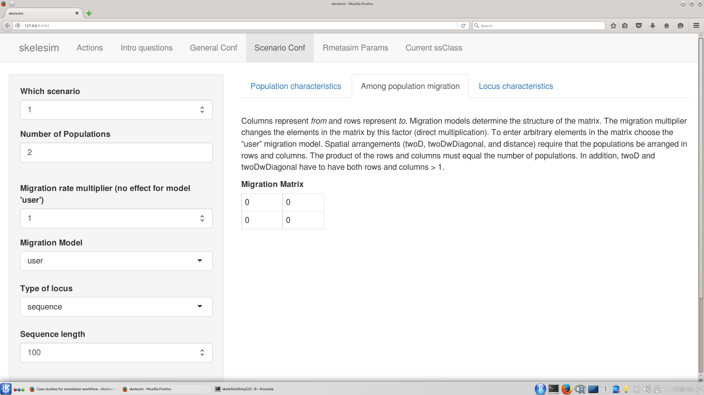
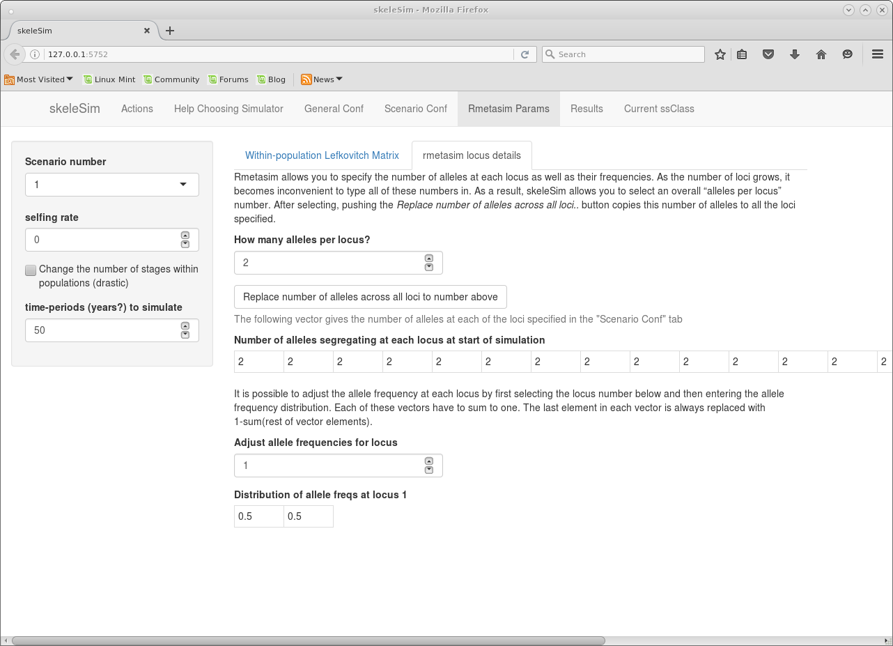

This vignette will create a forecast of possible outcomes for a population of interest, such as a rare species.   
These are examples of null model construction using simulators, to help showcase possible uses of SkeleSim.

##Overall instructions: getting started    

launch the skeleSim GUI
```{r,echo=T,eval=FALSE}
 library(skeleSim)     
 skeleSimGUI()   
```

Skelesim involves several steps of operation.  First you will perform some basic setup tasks like setting a root directory, file naming, and choosing a simulator.  Then you will define your first scenario. Additional scenarios will be easy to add after that. Each step occurs through a GUI interface. At any time you can also see "under the hood" by looking at the skeleSim object, which has all parameters of all scenarios (and more).


**Objective: To create a forecast of possible outcomes for a population of interest, such as a rare species.**  Say the species has already been genotyped at its current state, and managers would like to know what will happen to the population in 50 years (1) if no management action is taken or (2) if management is taken to connect this population to another population.  You will want to compare number of alleles that exist in your population under both of these actions: no action and reconnecting populations.

Because we have a current genetic dataset for the population(s), we want to simulate forward in time (forward in time is the only way to use current genetic data to start the simulation).

The skeleSim interface has multiple tabs.  You will initially need to go through all the tabs in order to define your simulation parameters.  

**Actions tab- saving and loading.**  The first tab "Actions" is used when you are ready to run your simulations (not yet!) or if you have already run some scenarios and want to add a new, different scenario, so you want to upload an existing skeleSim object (nope, not yet). These actions will be covered later. You will want to set your 'Simulation Root Directory'. 


The first thing to do is to click on "Help Choosing Simulator". This tab is to help you decide whether to use a forward in time or coalescent approach.  


**General Conf Tab: General parameters of skelesim.**  Since you already know you want a forward in time simulation, move on to "General Conf".   
       
1. Name your project.  This should distinguish this project from any other simulation projects you are working on (such as species name, objective, etc).  We'll call this one "Connect_or_not".  
2. Deselect "Coalescent simulator?". Note that the "FastSimCoal" tab has changed to "RmetaSim".     
3. Choose the number of simulation rep(licates).The more you run, the longer it takes. For a first pass, you might run 100. For more refined estimates you might run 1000.     
4. Choose which analyses you will run (see text explaining the Analyses).  For now, you can check each box.   
5. Set the number of permutations for significance tests. Start with 100.   
6. Name the directory in which you want to run simulations.  This directory might include already genotyped files, previously saved results, or other related files.  Notice that when you change this, and some other parameters in skeleSim, you see immediate feedback on the right part of the screen.       

   

**Scenario Conf Tab: Population/ sample size, migration, loci**  Next go to the tab "Scenario Conf".  This is where most of your simulation parameters will be defined.  Note that there is a tab structure *within* this tab: "Population characteristics," "Among population migration rate" and "Locus characteristics".  We'll fill out each of these in turn.  First though we must fill out the box on the left.  This defines the very basics: number of populations, etc.

  

Our simulation is going to be for two disconnected populations that may or may not get connected via management.   
    
1. Choose "2" for number of populations.  You can see that as you increase the number of populations, more text boxes open on the right- as you add more populations you have to define each population size.  
2. Choose your population sizes and sample sizes.  Let's make one population big (2000) and one small (100).  And we can take 20 samples from each.

Now click on "Among population migration rate".  This page allows you to set each pairwise, directional migration rate (from and to each population from each other population).  Our first scenario is going to assume no migration at all, so select "user" under the Migration Model and enter zeroes in each box.  Note that on the left there is a pull down menu which has different migration models: 2 dimensional stepping stone, etc.  (You can try each of these to see the available options and what each looks like.)  'User' means that you will manually define each cell of the matrix- the other options help fill out the cells with internal calculations.  Distance means that a user defined function of dispersal must be given.



Now click on "Locus Characteristics".  This page allows you to set the number of loci (on the left), type of molecular marker (on the left), and mutation rate (on the right).  For this first try we can choose "microsatellite" and leave the mutation rates as a constant rate with the default (1e -4).  Type in 20 for number of loci.  

  

**Rmetasim Params Tab: life history matrices and allele frequencies**  Now the basic parameters are set.  The next step is some particular parameters to the underlying simulation engine, either rmetasim or simcoal.  The two things you can do that are specific to rmetasim are to specify the reproduction/ mating/ survival matrices, and to specify the initial allele frequencies for the population. In this case we are especially interested to start the population with a given set of allele frequencies. 


   





Now that you have defined your first scenario, you can click on the "Current ssClass" tab at the top.  This will show you 'under the hood' all the slots in this object.  You can see all the parameters that you just set by looking at "@ scenarios :List of 1".


**First Save.**  It's now a good point to save the current object.  Just go to the "Actions" tab and click "save skelesim parameters to a file".  Just type in a filename.

Now, to define the other scenario, the one with migration.  What you want to do is keep all the parameters of the scenario the same except change the migration rate.  So go to the "Scenario Conf" tab and change the "which scenario" box to "2" or use the "Add a new scenario" botton to create a new scenario. Confirm that the pull down list for "Migration Model" has selected "user".  You can now specify a migration into the population of interest (within "Among population migration".  Enter a migration rate of 0.1 from population 1 to population 2.  The diagram below the migration table helps you to make sure you've made the migration going in the right direction!


And that is all you have to do to create this second scenario.  The unique aspect of skeleSim is that to create a new scenario, just start with one of the existing scenarios, increase the number of scenarios by one, and adjust the parameter you want to change.

Now go back to the "Current ssClass" tab at the top and look over the parameters of each of your simulations to make sure everything is as you'd like it to be.  You should now see 2 entries that say "Formal class 'scenario.params' [package "skeleSim"] with 10 slots".  These are you two scenarios

Now you are ready to run.  Go back to the Actions tab, save your skelesim object, select the root directory you would like to run in, and click run simulation.    
   
Back on the Actions tab, use the File operations "Read skelesim object from file" to load the skelesim.out.rdata file you created. You may then view results in the Results tab. 


You can also open your skelesim object in the running R session.  Just load up the .Rdata file ("Connect_or_not.20160316.1028.1618.params.rdata" for example) and type in ssClass- this will show your object and the results.
