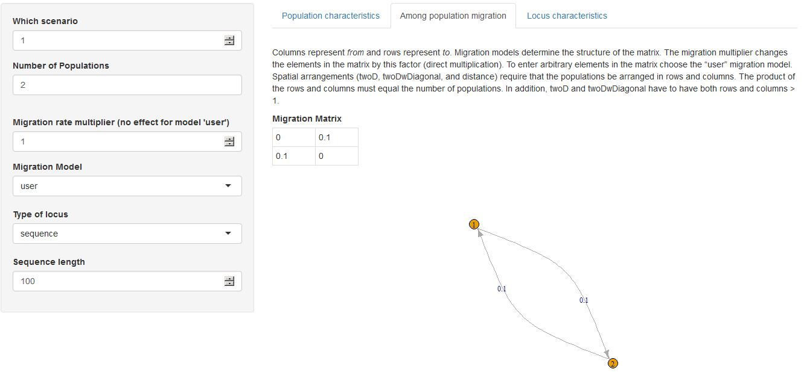

This vignette will help plan the best sampling effort in terms of number of markers or number of samples, for a planned population genetic study. **The best sampling effort is one that ensures you detect the effect or process you are interested in.**    


## Overall instructions: getting started    

launch the skeleSim GUI
```{r,echo=T,eval=FALSE}
 library(skeleSim)     
 skeleSimGUI()   
```


In a common example, we want to infer demographic change from a genetic dataset.  Specifically, we want to conclude, did a species undergo a recent population decline?  This may be detected in a variety of ways but one simple way is the M-ratio.  The M-ratio is a genetic statistic calculated as (number of occupied allelic states/ total number of possible states), and is only for microsatellites. Low values of this ratio indicate a recent bottleneck, as described in [Garza and Williamson (2001)](http://onlinelibrary.wiley.com/doi/10.1046/j.1365-294X.2001.01190.x/full).

So, we want to compare the power of different sampling strategies (different number of markers and different number of samples) to detect a bottleneck using a simple statistic (M ratio).  We want to be able to say, for example, 10 markers have a 90% chance of detecting a bottleneck of a given size.  In the end, the goal is to identify a sampling strategy that has sufficiently high power for this type of study, but not to waste sampling effort (not to sample TOO much).  As described in Hoban et al (2013 Methods in Ecol & Evol), simulations can be used to test a variety of sampling strategies. 

To use skelesim to test different sampling strategies, you will want to simulate different demographic histories (different sizes of bottlenecks) as well as different sampling strategies and number of molecular markers.  In this example, you will simulate three severities of bottleneck: from a historic size of 20 000 to 500, and from a historic size of 2 000 to 500.  You will also simulate genotyping 5, 10, or 20 microsatellites.  Each combination of ‘number of markers’ and ‘population demographic history’ is referred to as a ‘scenario.’  While this example will include six scenarios (2 times 3) for this kind of study (planning sampling strategy), you may want to simulate many more scenarios.

Skelesim will allow you to easily create genetic datasets under these conditions.  It will also summarize the datasets under each scenario with genetic statistics like the M ratio.  You can thus see what M ratio would result from these different bottlenecks, when genotyping is done with a certain number of markers.  You can calculate the mean M ratio as well as the variance, for each scenario. SkeleSim calculates the M-ratio as part of the "Locus" group of analyses for genind objects from rmetasim.

In Hoban et al (2013 Methods in Ecol & Evol), I found that, for species with different sized bottlenecks (specifically European bison and Iberian lynx), very different M-ratios would develop, and that different sampling strategies were appropriate.  In particular, weaker bottlenecks (less severe population size reductions) would require higher sampling efforts.

To get started, take a look at the interface.  You will see that the skeleSim interface has multiple tabs.  You will usually need to go through all the tabs in order to define your simulation parameters.  

**Actions tab- saving and loading.**  The first tab "Actions" is used when you are ready to run your simulations (not yet!) or if you have already run some scenarios and want to add a new, different scenario, so you want to upload an existing skeleSim object (nope, not yet).  These actions will be covered later.

The first thing to do is to click on "Intro Questions".  This tab is to help you decide whether to use a forward in time or coalescent approach.  

**General Conf Tab: General parameters of skelesim.** You already know you want a forward in time simulation, so move on to "General Conf". Under here, you name your project. This should distinguish this project from any other simulation projects you are working on (such as species name, objective, etc). We'll call this one "Power_analysis_1". Then you choose the number of simulation rep(licates). The more you run, the longer it takes. For a first pass, you might run 100. For more refined estimates you might run 1 000. Last you choose which analyses you will run (see text explaining the Analyses). For now, you can check each box. Lastly, name the directory that you want simulations to run in. This directory might include already genotyped files, previously saved results, or other related files. Notice that when you change this, and some other parameters in skeleSim, you see immediate feedback on the right part of the screen. 


   


*Scenario Conf Tab: Population/ sample size, migration, loci * Next go to the tab "Scenario Conf". This is where most of your simulation parameters will be defined. Note that there is a tab structure within this tab: "Population characteristics," "Among population migration rate" and "Locus characteristics". We'll fill out each of these in turn. First though we must fill out the box on the left. This defines the very basics: number of populations, etc.  In this example we will have two populations.  One of these will have gone through a bottleneck and the other not.  For now, set the population size of one population to 1000, and the other population to 10.  We will leave sample sizes at 20.

Next click on the next tab within "Scenario Conf"- "Among population migration rate"  Here, first click the "user" migration Model on the left.  Then, fill in a migration rate of 0.01 from each population to the other.


  


Next, click on "Locus Characteristics".  Here, define the number of loci to "20".  We will leave all mutation rates at the default for now.  Ok, now all scenario parameters are set.  We will move on to setting simulator specific parameters, in this case for Simcoal.


  


**Simcoal Params Tab: historical events, growth rates, sample times  **Now the basic parameters are set.  The next step is some particular parameters to the underlying simulation engine, either rmetasim or simcoal.  The three things you can do that are specific to simcoal are historical events, growth rates, and sample times.  We will focus on historical events and growth rates for this tutorial.  First we will define the historical event.  In this simulation, the two populations will have a common ancestral population, so they need to merge at some time in the past.  We will simulate a divergence 50 generations ago.  To do this, click above the population "2" in the graphic.  Then click on the population 1, approximately where in time you want the event to occur.  Here we want it to occur at about 50.


  


Next is to determine the growth rates.  This requires a calculation based on the simple logistic growth equation.  In simcoal, a population that has been undergoing demographic decline is simulated using an expansion going back in time (the reverse of a decline).  For a population of current size 100 to reach a population size of 1000, 50 generations ago, will require a growth rate of 0.046053.  So type this into the population growth rate box for population 2.  Leave population 1 growth rate as 0 (steady size).

Now your first scenario is ready!


Now that you have defined your first scenario, you can click on the "Current ssClass" tab at the top.  This will show you 'under the hood' all the slots in this object.  You can see all the parameters that you just set by looking at "@ scenarios :List of 1".


**First Save.**  It's now a good point to save the current object.  Just go to the "Actions" tab and click "save skelesim parameters to a file".  Just type in a filename.


Now, to define another scenario, with fewer loci.  What you want to do is keep all the parameters of the scenario the same except change the number of loci.  So go to the "Scenario Conf" tab and click the up arrow next to "which scenario" so that it says "2".  Careful not to click further (3,4,..) as that will create more new scenarios.  Change the number of loci to "10"


And that is all you have to do to create this second scenario.  The unique aspect of skeleSim is that to create a new scenario, just start with one of the existing scenarios, increase the number of scenarios by one, and adjust the parameter you want to change.

Now go back to the "Current ssClass" tab at the top and look over the parameters of each of your simulations to make sure everything is as you'd like it to be.  You should now see 2 entries that say "Formal class 'scenario.params' [package "skeleSim"] with 10 slots".  These are your two scenarios
